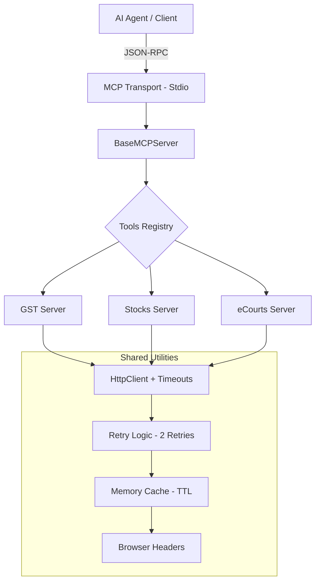

# 🏗 India-MCP Architecture

The India-MCP ecosystem is designed for **resilience** and **consistency** when interacting with fragmented Indian digital infrastructure.

## 📐 Unified Design Pattern

All servers in the ecosystem follow a shared lifecycle managed by the `BaseMCPServer`:

## 🛡 Resilience Layers

### 1. Request Timeouts & Retries
Government portals (eCourts, GST, RTO) can be intermittently slow or unresponsive. 
- **Timeout**: Each request has a strict 10-15s timeout.
- **Retry**: Automated 2-retry policy with exponential backoff.

### 2. Intelligent Caching
To prevent IP blocking and improve speed, we implement a memory-based TTL cache:
- **Static Data** (Courts, Bank Branches): 24h
- **Volatile Data** (Stock Prices, Cause Lists): 15s - 1min

### 3. Fallback Strategies
- **Primary**: Official API or optimized endpoints.
- **Secondary**: HTML Scraping/Parsing (e.g., eCourts, Railways).
- **Final**: Cached stale data or Offline Top 200 databases.

## 📄 Standardized Responses
Every tool returns a `NormalizedResponse` to ensure AI agents can reliably interpret success or failure without parsing raw HTTP errors.
